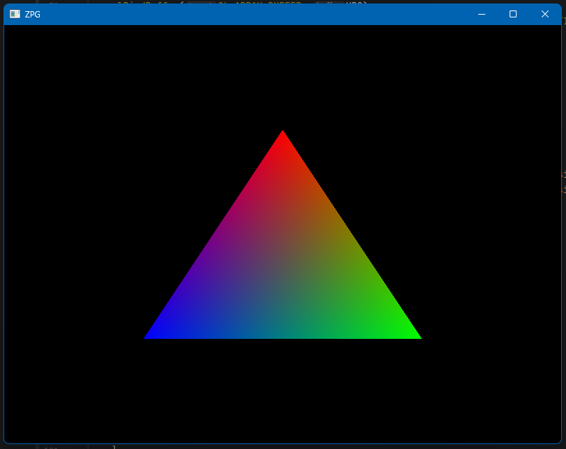
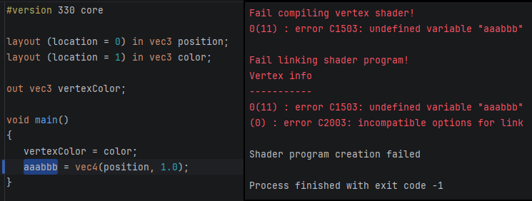
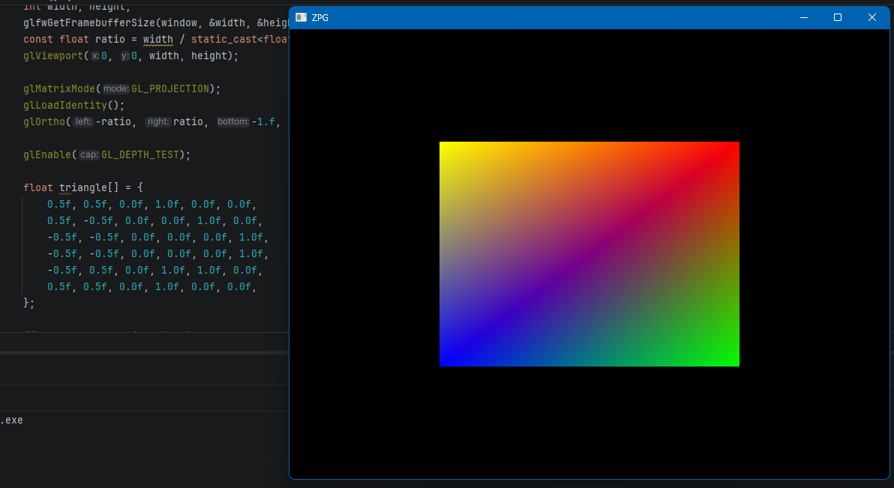
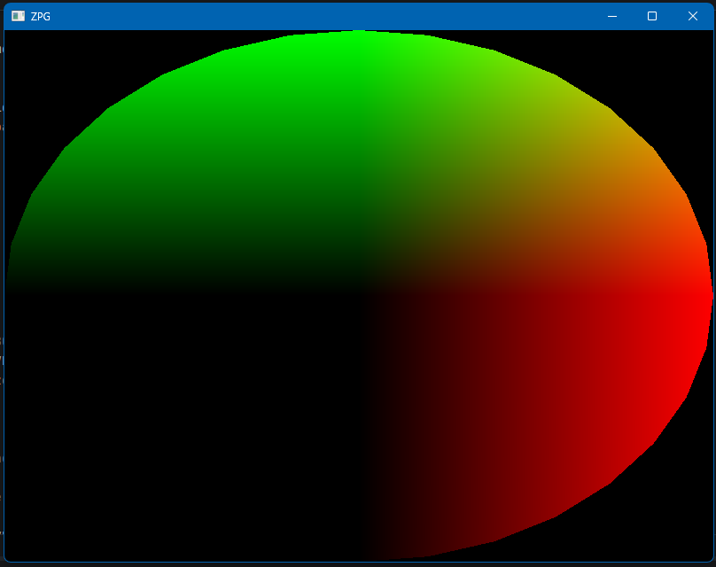
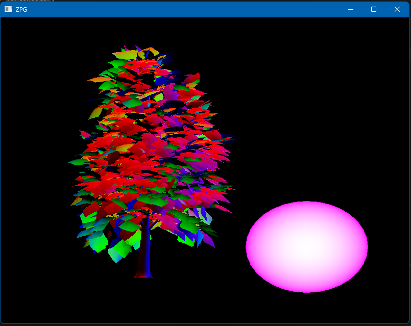

1. Knihovna GLAD, třída pro vertex a fragment shader, VBO, VAO. 
2. Používám nedefinovanou proměnnou ve vertex shaderu. Program vypsal chybu a ukončil se. 
3. K prvnímu trojuhelníku jsem přidal druhý a nový bod nabarvil na žluto (1, 1, 0). 
4. Při vytváření VBO jsem místo mého pole `triangle` použil `sphere`. 
5. Přidal jsem druhý VBO, VAO, a shader program. Modely jsou posunuté a mají různé barvy. 
6. Splněno